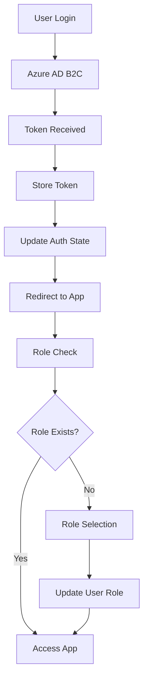
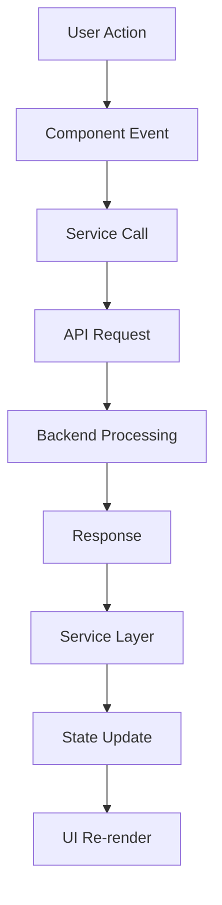

# Architecture Guide

This document provides a comprehensive overview of the Gainit frontend application architecture, including component structure, data flow, and key design patterns.

## 🏗️ High-Level Architecture

### Application Overview

Gainit is a React-based single-page application (SPA) that provides a collaborative platform for developers, mentors, and nonprofit organizations. The application follows a modern frontend architecture with clear separation of concerns.

```
┌─────────────────────────────────────────────────────────────┐
│                    Browser (Client)                         │
├─────────────────────────────────────────────────────────────┤
│  React Application (SPA)                                    │
│  ├── Authentication Layer (Azure MSAL)                     │
│  ├── Routing Layer (React Router)                          │
│  ├── State Management (React Hooks + Context)              │
│  ├── UI Components (React Components)                      │
│  └── Service Layer (API Integration)                       │
├─────────────────────────────────────────────────────────────┤
│  External Services                                          │
│  ├── Azure AD B2C (Authentication)                         │
│  ├── Backend API (REST)                                    │
│  └── SignalR (Real-time Communication)                     │
└─────────────────────────────────────────────────────────────┘
```

## 📁 Project Structure

### Directory Organization

```
src/
├── auth/                    # Authentication configuration
│   ├── auth.ts             # Main authentication logic
│   ├── AuthCallback.tsx    # OAuth callback handler
│   └── msalConfig.ts       # MSAL configuration
├── components/             # Reusable UI components
│   ├── code/              # Code-related components
│   ├── common/            # Shared components
│   ├── layout/            # Layout components
│   ├── milestones/        # Milestone management
│   └── project/           # Project-specific components
├── config/                # Configuration files
│   └── api.js             # API configuration
├── css/                   # Stylesheets
├── hooks/                 # Custom React hooks
│   ├── useAuth.ts         # Authentication hook
│   └── useOnboarding.js   # Onboarding hook
├── pages/                 # Page components
│   ├── About/             # About page
│   ├── ChooseRole/        # Role selection
│   ├── HomePage/          # Landing page
│   ├── ProfilePage/       # User profiles
│   ├── ProjectPage/       # Project details
│   ├── SearchProjects/    # Project search
│   └── WorkArea/          # Collaboration workspace
├── services/              # API service layers
│   ├── api.js             # Base API service
│   ├── github.api.ts      # GitHub integration
│   ├── milestones.api.ts  # Milestone management
│   ├── tasks.api.ts       # Task management
│   └── usersService.js    # User management
└── utils/                 # Utility functions
    └── userUtils.ts       # User-related utilities
```

## 🔧 Core Components

### Authentication Architecture

The authentication system uses Azure AD B2C with Microsoft Authentication Library (MSAL):

```typescript
// Authentication Flow
┌─────────────┐    ┌──────────────┐    ┌─────────────┐
│   User      │───▶│  Azure AD    │───▶│  Application│
│             │    │     B2C      │    │             │
└─────────────┘    └──────────────┘    └─────────────┘
       │                   │                   │
       │                   │                   │
       ▼                   ▼                   ▼
┌─────────────┐    ┌──────────────┐    ┌─────────────┐
│   Login     │    │   Token      │    │  Protected  │
│   Redirect  │    │  Validation  │    │   Routes    │
└─────────────┘    └──────────────┘    └─────────────┘
```

**Key Files:**
- `src/auth/auth.ts` - Main authentication logic
- `src/auth/msalConfig.ts` - MSAL configuration
- `src/hooks/useAuth.ts` - Authentication hook
- `src/components/RoleCheck.jsx` - Role-based routing

### Routing Architecture

The application uses React Router DOM with a nested routing structure:

```jsx
// Route Structure
App
├── Public Routes
│   ├── / (HomePage)
│   ├── /about (About)
│   ├── /search-projects (SearchProjects)
│   └── /project/:id (ProjectPage)
└── Protected Routes (wrapped with RoleCheck)
    ├── /work (WorkArea)
    ├── /profile/:id (ProfilePage)
    └── /choose-role (ChooseRole)
```

**Key Components:**
- `src/App.jsx` - Main routing configuration
- `src/components/RoleCheck.jsx` - Authentication guard
- `src/components/ScrollToTop.jsx` - Navigation utilities

### State Management

The application uses React's built-in state management with hooks and context:

```typescript
// State Management Pattern
┌─────────────────┐    ┌─────────────────┐    ┌─────────────────┐
│   Local State   │    │  Context State  │    │  Server State   │
│   (useState)    │    │  (useContext)   │    │  (API calls)    │
└─────────────────┘    └─────────────────┘    └─────────────────┘
         │                       │                       │
         │                       │                       │
         ▼                       ▼                       ▼
┌─────────────────────────────────────────────────────────────┐
│                Component State Tree                        │
└─────────────────────────────────────────────────────────────┘
```

**State Categories:**
1. **Local State**: Component-specific state using `useState`
2. **Authentication State**: Global auth state via `useAuth` hook
3. **Server State**: Data fetched from APIs using service functions

## 🎨 Component Architecture

### Component Hierarchy

```
App
├── ErrorBoundary
├── PlatformNavBar
├── ScrollToTop
└── main-content
    └── Routes
        ├── HomePage
        ├── About
        ├── SearchProjects
        ├── ProjectPage
        ├── ProfilePage
        ├── WorkArea
        └── ChooseRole
```

### Component Design Patterns

#### 1. Container/Presentational Pattern

```jsx
// Container Component (Logic)
const ProjectContainer = () => {
  const [projects, setProjects] = useState([]);
  const [loading, setLoading] = useState(true);

  useEffect(() => {
    fetchProjects().then(setProjects).finally(() => setLoading(false));
  }, []);

  return <ProjectList projects={projects} loading={loading} />;
};

// Presentational Component (UI)
const ProjectList = ({ projects, loading }) => {
  if (loading) return <LoadingSpinner />;
  
  return (
    <div className="project-list">
      {projects.map(project => (
        <ProjectCard key={project.id} project={project} />
      ))}
    </div>
  );
};
```

#### 2. Custom Hooks Pattern

```jsx
// Custom Hook
const useProjects = () => {
  const [projects, setProjects] = useState([]);
  const [loading, setLoading] = useState(false);
  const [error, setError] = useState(null);

  const fetchProjects = useCallback(async () => {
    setLoading(true);
    try {
      const data = await projectsService.getAll();
      setProjects(data);
    } catch (err) {
      setError(err.message);
    } finally {
      setLoading(false);
    }
  }, []);

  return { projects, loading, error, fetchProjects };
};

// Component using the hook
const ProjectPage = () => {
  const { projects, loading, error, fetchProjects } = useProjects();

  return (
    <div>
      {loading && <LoadingSpinner />}
      {error && <ErrorMessage error={error} />}
      {projects.map(project => <ProjectCard key={project.id} project={project} />)}
    </div>
  );
};
```

## 🔌 Service Layer Architecture

### API Service Structure

```typescript
// Service Layer Pattern
┌─────────────────┐    ┌─────────────────┐    ┌─────────────────┐
│   Components    │───▶│  Service Layer  │───▶│   Backend API   │
│                 │    │                 │    │                 │
└─────────────────┘    └─────────────────┘    └─────────────────┘
         │                       │                       │
         │                       │                       │
         ▼                       ▼                       ▼
┌─────────────────┐    ┌─────────────────┐    ┌─────────────────┐
│   UI Logic      │    │  Business Logic │    │   Data Layer    │
│   State Mgmt    │    │  Error Handling │    │   HTTP Requests │
└─────────────────┘    └─────────────────┘    └─────────────────┘
```

**Service Files:**
- `src/services/api.js` - Base API configuration
- `src/services/projectsService.js` - Project-related API calls
- `src/services/usersService.js` - User management API calls
- `src/services/tasksService.js` - Task management API calls
- `src/services/githubService.js` - GitHub integration

### API Integration Pattern

```javascript
// Base API Service
class ApiService {
  constructor() {
    this.baseURL = import.meta.env.VITE_API_BASE_URL;
    this.setupInterceptors();
  }

  setupInterceptors() {
    // Request interceptor for authentication
    axios.interceptors.request.use(
      (config) => {
        const token = this.getAuthToken();
        if (token) {
          config.headers.Authorization = `Bearer ${token}`;
        }
        return config;
      },
      (error) => Promise.reject(error)
    );

    // Response interceptor for error handling
    axios.interceptors.response.use(
      (response) => response,
      (error) => this.handleError(error)
    );
  }
}

// Specific Service
export const projectsService = {
  async getAll() {
    const response = await api.get('/api/projects');
    return response.data;
  },

  async getById(id) {
    const response = await api.get(`/api/projects/${id}`);
    return response.data;
  },

  async create(projectData) {
    const response = await api.post('/api/projects', projectData);
    return response.data;
  }
};
```

## 🔄 Data Flow Architecture

### Authentication Data Flow



### Application Data Flow



## 🎯 Key Design Patterns

### 1. Error Boundary Pattern

```jsx
class ErrorBoundary extends React.Component {
  constructor(props) {
    super(props);
    this.state = { hasError: false, error: null };
  }

  static getDerivedStateFromError(error) {
    return { hasError: true, error };
  }

  componentDidCatch(error, errorInfo) {
    console.error('Error caught by boundary:', error, errorInfo);
  }

  render() {
    if (this.state.hasError) {
      return <ErrorFallback error={this.state.error} />;
    }

    return this.props.children;
  }
}
```

### 2. Higher-Order Component (HOC) Pattern

```jsx
const withAuth = (WrappedComponent) => {
  return (props) => {
    const { isAuthenticated, loading } = useAuth();

    if (loading) return <LoadingSpinner />;
    if (!isAuthenticated) return <LoginRedirect />;

    return <WrappedComponent {...props} />;
  };
};

// Usage
const ProtectedComponent = withAuth(MyComponent);
```

### 3. Render Props Pattern

```jsx
const DataFetcher = ({ children, url }) => {
  const [data, setData] = useState(null);
  const [loading, setLoading] = useState(true);
  const [error, setError] = useState(null);

  useEffect(() => {
    fetch(url)
      .then(res => res.json())
      .then(setData)
      .catch(setError)
      .finally(() => setLoading(false));
  }, [url]);

  return children({ data, loading, error });
};

// Usage
<DataFetcher url="/api/projects">
  {({ data, loading, error }) => (
    <div>
      {loading && <Spinner />}
      {error && <ErrorMessage error={error} />}
      {data && <ProjectList projects={data} />}
    </div>
  )}
</DataFetcher>
```

## 🔒 Security Architecture

### Authentication Security

1. **Token Management**
   - Access tokens stored securely in MSAL
   - Automatic token refresh
   - Token validation on each request

2. **Route Protection**
   - Role-based access control
   - Authentication guards
   - Redirect to login for unauthenticated users

3. **API Security**
   - Bearer token authentication
   - CORS configuration
   - Input validation and sanitization

### Data Security

```typescript
// Security Measures
┌─────────────────┐    ┌─────────────────┐    ┌─────────────────┐
│   Input         │    │   Processing    │    │   Output        │
│   Validation    │    │   Sanitization  │    │   Encoding      │
└─────────────────┘    └─────────────────┘    └─────────────────┘
         │                       │                       │
         ▼                       ▼                       ▼
┌─────────────────────────────────────────────────────────────┐
│                Security Layer                              │
└─────────────────────────────────────────────────────────────┘
```

## 📱 Responsive Design Architecture

### Mobile-First Approach

```css
/* Base styles (mobile) */
.component {
  width: 100%;
  padding: 1rem;
}

/* Tablet styles */
@media (min-width: 768px) {
  .component {
    width: 50%;
    padding: 1.5rem;
  }
}

/* Desktop styles */
@media (min-width: 1024px) {
  .component {
    width: 33.333%;
    padding: 2rem;
  }
}
```

### Component Responsiveness

```jsx
const ResponsiveComponent = () => {
  const [isMobile, setIsMobile] = useState(false);

  useEffect(() => {
    const checkMobile = () => {
      setIsMobile(window.innerWidth < 768);
    };

    checkMobile();
    window.addEventListener('resize', checkMobile);
    return () => window.removeEventListener('resize', checkMobile);
  }, []);

  return (
    <div className={`component ${isMobile ? 'mobile' : 'desktop'}`}>
      {isMobile ? <MobileLayout /> : <DesktopLayout />}
    </div>
  );
};
```

## 🚀 Performance Architecture

### Code Splitting

```jsx
// Lazy loading components
const ProjectPage = lazy(() => import('./pages/ProjectPage/ProjectPage'));
const ProfilePage = lazy(() => import('./pages/ProfilePage/ProfilePage'));

// Route-based code splitting
<Route 
  path="/project/:id" 
  element={
    <Suspense fallback={<LoadingSpinner />}>
      <ProjectPage />
    </Suspense>
  } 
/>
```

### Bundle Optimization

```javascript
// Vite configuration for optimization
export default defineConfig({
  build: {
    rollupOptions: {
      output: {
        manualChunks: {
          vendor: ['react', 'react-dom'],
          router: ['react-router-dom'],
          auth: ['@azure/msal-browser', '@azure/msal-react'],
          ui: ['lucide-react', 'react-icons']
        }
      }
    }
  }
});
```

## 🔄 Real-time Communication

### SignalR Integration

```typescript
// SignalR service architecture
class SignalRService {
  private connection: signalR.HubConnection;

  constructor() {
    this.connection = new signalR.HubConnectionBuilder()
      .withUrl("/collaborationHub")
      .build();
  }

  async start() {
    await this.connection.start();
    this.setupEventHandlers();
  }

  private setupEventHandlers() {
    this.connection.on("TaskUpdated", (task) => {
      // Handle task updates
    });

    this.connection.on("UserJoined", (user) => {
      // Handle user joining
    });
  }
}
```

## 📊 Monitoring and Analytics

### Error Tracking

```javascript
// Error tracking setup
const trackError = (error, context) => {
  console.error('Application Error:', error, context);
  
  // Send to monitoring service
  if (window.gtag) {
    window.gtag('event', 'exception', {
      description: error.message,
      fatal: false
    });
  }
};
```

### Performance Monitoring

```javascript
// Performance tracking
const trackPerformance = (metric, value) => {
  if (window.gtag) {
    window.gtag('event', 'timing_complete', {
      name: metric,
      value: value
    });
  }
};
```

## 🔮 Future Architecture Considerations

### Scalability

1. **State Management**: Consider Redux or Zustand for complex state
2. **Micro-frontends**: Split into smaller, independent applications
3. **Server-side Rendering**: Implement Next.js for better SEO
4. **Progressive Web App**: Add PWA capabilities

### Technology Evolution

1. **React 18+**: Leverage concurrent features
2. **TypeScript**: Full TypeScript migration
3. **GraphQL**: Consider GraphQL for API layer
4. **WebAssembly**: For performance-critical operations

This architecture provides a solid foundation for the Gainit platform while maintaining flexibility for future enhancements and scalability requirements.
